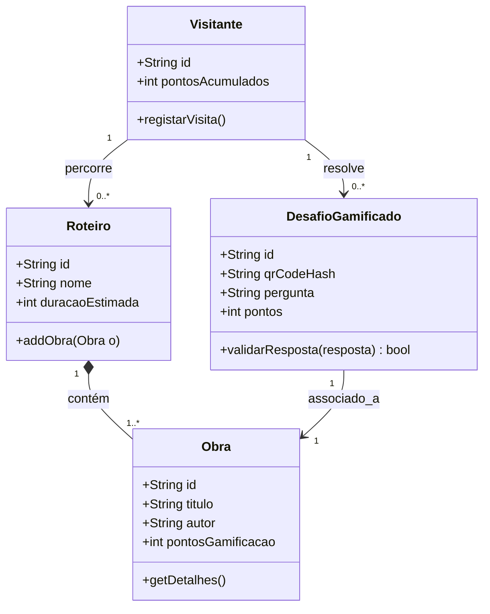
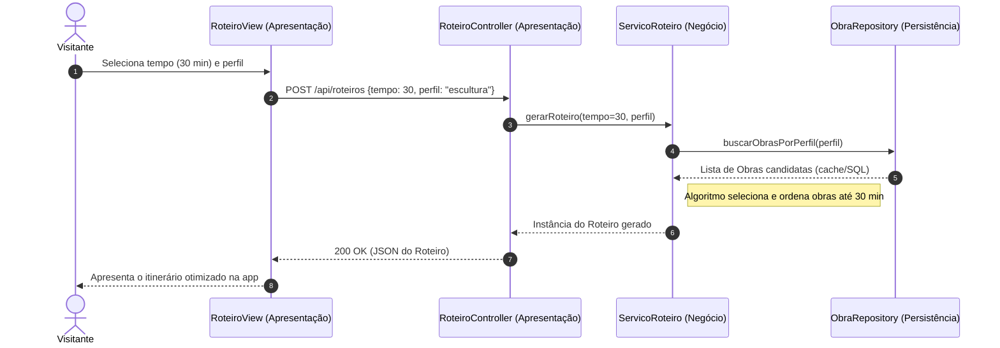
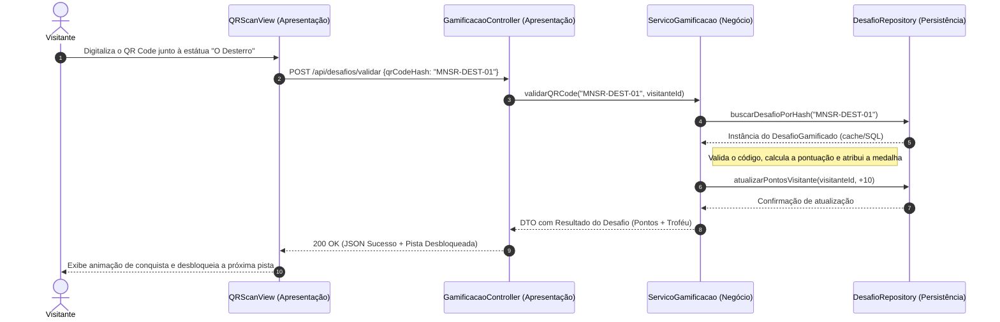

# Arquitetura de Software — App MNSR Digital

## 1. Visão Geral
A App MNSR Digital adota o padrão de Arquitetura em 3 Camadas (Layered Architecture / API REST) para garantir a Separação de Responsabilidades , Alta Coesão e Baixo Acoplamento:  

1. Camada de Apresentação (UI / REST Controllers): Captura interações do visitante na interface móvel/PWA e expõe/consome endpoints RESTful em formato JSON
2. Camada de Lógica de Negócio (Service Layer): Contém as regras de negócio, algoritmos de geração de roteiros por tempo, validação de QR Codes e orquestração do assistente de IA (RAG)
3. Camada de Persistência / Dados (Repository Layer): Encapsula o acesso à base de dados SQL e gere a cache local offline no dispositivo móvel

--- 
## 2. Diagrama de Classes UML (Visão Estrutural) 

--- 
## 3. Diagrama de Sequência UML (Visão Dinâmica) 
### US-01 (Gerar Roteiro por Tempo Disponível)

### US-02 (Validação de QR Code na Caça ao Tesouro)

---
